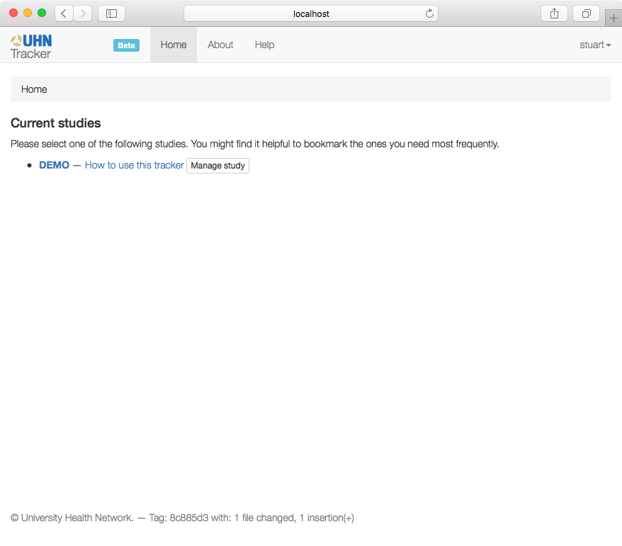
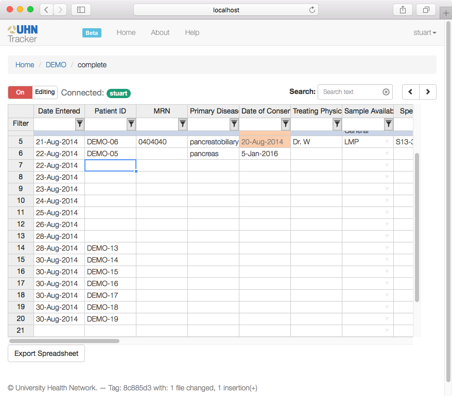
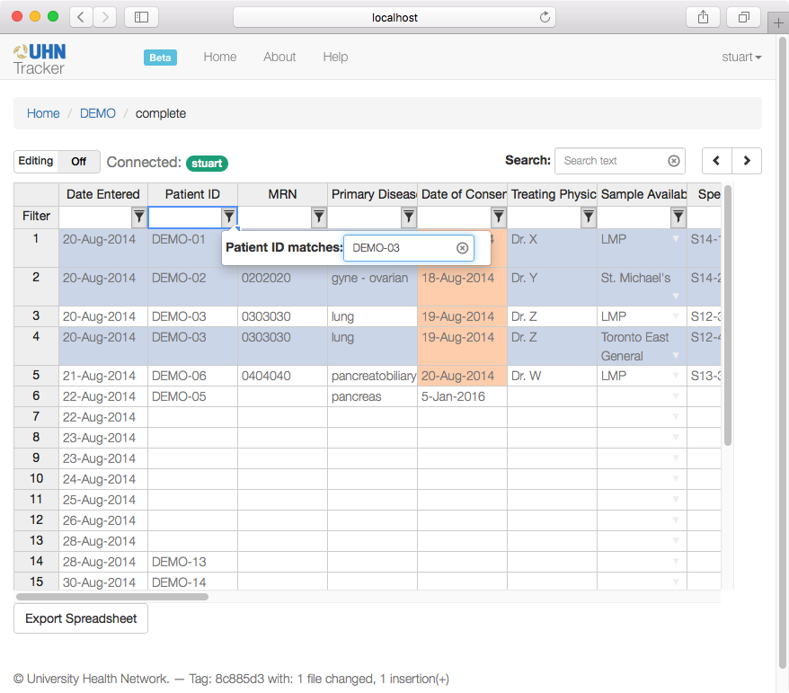

# User's Guide

The tracker is a web-based tool to help a group of people coordinate data for a project. Primarily, it behaves something like a secure version of a Google Docs spreadsheet, allowing many people to edit the same data at the same time, and showing each user changes that are made by others.

There are some significant differences, however:

 * The tracker works more like a database, with fields or *attributes* of different types, instead of columns as is normal for a a spreadsheet. This means, for example, that doubl-clicking on a date cell can pop up a date editor, so there's less risk of the wrong data being entered in the wrong place.
 * Each user may be given a *view* onto the data, so they can't always see some of the attribute values that others can. This is important for clinical data, as it means confidential information can be restricted to those who are allowed to see it, while others can see the non-confidential parts that they need to do their jobs.

When you log into the tracker, you'll see a list of the studies that you are allowed to access. It'll look something like this:

If you choose one of these listed studies, and one of the views that you're allowed to see, you'll get to see the actual study data, which will look something like this:

By default, editing is locked, so you can't accidentally overwrite data. If you switch the toggle for editing, then, from then on, you can enter data into the cells as you need to.

A couple of extra tools can help you find data that you need:

 * There's a search box: if you type some text into it and press enter, the tracker will locate all the cells that match that text. You can use the forwards and backwards arrows move between the matching cells.
 * There are column filters, that are superficially like those in Excel or a spreadsheet tool, but are actually a little more powerful. If you select the small filter button at the top of a column, you can enter text, and all rows which match that text will be selected, all others will be hidden. That looks a little like this:

 

 * Column filters can also use expressions. If you use a filter like `*KRAS*` then any rows where there's a cell that matches a pattern (i.e., that contains `KRAS` anywhere in the value) will be selected. You can also use some boolean expressions, like `*KRAS* or *EGFR*`, and there are some special operations you can use on dates, like `before 2015-02-28 and after 2015-02-01` to select only those rows with a date from February 2015.

And that's the quick start guide for the tracker.

For more information:

 * [The administration guide](admin-guide.html) is helpful if you want to set up and run a study, change the attributes or who is allowed to see what.
